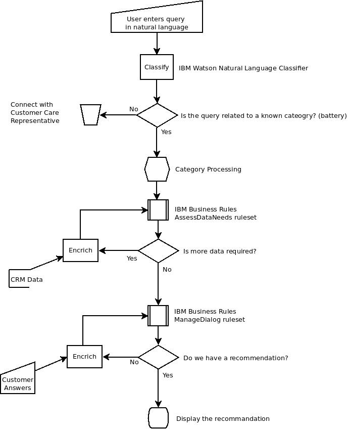

# Workload - Context Driven Dialog


###Context driven dynamic dialog example implemented in Cloud Foundry

This application demonstrates how to combine **IBM Watson™ Natural Language Classifier** with a rule-based system (ODM Bluemix Business Rules Service) to offer a context driven conversation solution, full flexibility in terms of code change, empowering the business user to change the conversation flow and recommendations. To learn basic concepts, see [Cognitive concepts 101](https://developer.ibm.com/cloudarchitecture/docs/cognitive-concepts-101/).


----


## Introduction

A sample application has been created so you can deploy it into your personal space 
after signing up for Bluemix. You will attach the **IBM Watson™ Natural Language Classifier** and 
**IBM Business Rules** services to the application as well as learn to begin using these services.

## What Does the Application Do?

The application is built as an example to demonstrate a customer care application for a mobile telecommunications company. It lets a registered user interact with the support system using natural language. 
The demonstration simulates a customer reaching out to a Customer Support team to ask question about battery issue on mobile device, the system load customer data and tries to assess 
the problem and provide a resolution using existing data, previous answers and recommendations. 

The demonstration system is trained to understand queries related to device batteries, and the CRM system stub has hard-coded entries for an iPhone and an iPad for the user.


As the customer writes their query in natural language , the Natural Language Classifier will classify the query. In this demonstration the **IBM Watson Natural Language Classifier** system
is trained to understand topics related to Mobile Phone batteries. Once the query is classified, the query is wrapped inside an assessment object that is used
to keep the context of the dialog and the customer data. This assessment is sent to the ***Business Rules*** engine to first assess if all the data needed, to deliver recommendations, are
present. Two type of data validation rules are implemented in a first decision service: customer profile present, and if the first query was classified as 'battery' issue
or device issue then load the owned products. Those data are coming from a Customer Relationship Management (CRM) system running on Premise. 
When data are loaded, the assessment is moved to 'Investigation' state where user will answer a set of questions to get the 'expert system' to deliver the most accurate recommendation.
The question flow is no more static but will take care of previous answer and customer data. 


The application has two components:
- A AngularJS front end which allows users to enter natural language queries, and answer questions
- A Python back end which offers a REST interface for the front end to communicate with the different components of the solution:
    * The Python application binds to **IBM Watson™ Natural Language Classifier** and **IBM Business Rules** services
    * A Mockup CRM application stub
       * In a real deployment this would typically be an API defined in API Connect as a front-end to the CRM application.
       
       

## Application flow
[]


1. The user enters a query (related to their mobile phone battery) on the website using natural language
2. The back-end application uses **Natural Language Classifier** to classify the query. 
3. From the derived category, the query is wrapped in an Assessment object that is sent to the **IBM Business Rules** data validation decision service.
4. While the data is deemed to be incomplete, encrich the data with information from different sources and revalidate with **IBM Business Rules** data validation decison service
5. When the data is deemed complete, call the **IBM Business Rules** dialog decision service to determine the best question to ask the customer
6. As the user selects the best answer, the answers are added to the Assessment object and sent to the **IBM Business Rules** dialog decision service.  Continue until a recommandation is reached
7. Display the recommandation to the user


## Deploying the application
The application can be deployed in two ways:

- Single click deploy via DevOps Services
- Manual push through Cloud Foundry command line client


You will need an account on Bluemix. If you are not already signed up, you can sign up on [https://www.bluemix.net](https://www.bluemix.net)


## Single click deploy via DevOps Services

[](https://console.ng.bluemix.net/devops/setup/deploy/?repository=https%3A//github.com/hassenius/context-driven-dialog)

Enjoy! (note, it may take minute or so for the app to start)


## Manual push through Cloud Foundry commmand line client

The goal is to download the application code from github and push it to Bluemix Runtimes to create a running
application that is bound to and consuming Watson services.

If you do not already have the Cloud Foundry command line client installed an configured, you will now need to 
follow the [instructions here](https://github.com/cloudfoundry/cli)

A reference guide can be found [here](https://new-console.ng.bluemix.net/docs/cli/reference/cfcommands/index.html)


1. Download the application code

     If you have git installed, you can clone the repository

     ```git clone **TODO INSERT URL**```

     or download and extract the [Zip file](https://github.com/hassenius/docs/archive/master.zip)
     
1. Create the services using the **Cloud Foundry command line tool** 

     ```
       cf create-service natural_language_classifier standard NaturalLanguageClassifier
       cf create-service businessrules standard BusinessRules
     ```

     
1. Push the Python application

     ```cf push```

     This will push the application as specified in the manifest.yaml file
     
     When the push is completed the application details will be reported, including the randomly generated URL. 
     Navigate to this URL to view and use the application.
     
